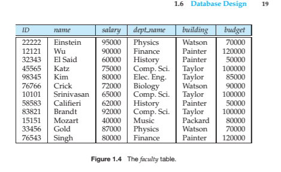
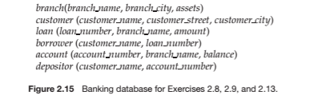
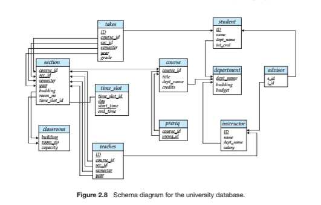
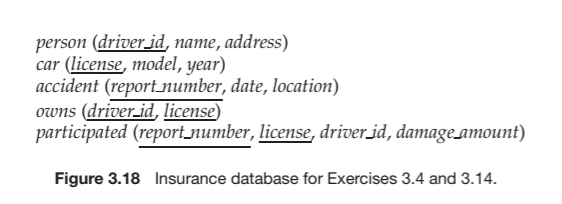

# COSC471 Homework 1

<script type="text/javascript"
        src="https://cdnjs.cloudflare.com/ajax/libs/mathjax/2.7.0/MathJax.js?config=TeX-AMS_CHTML"></script>

Ahmed Muhammad ~ 2021-09-19

## Chapter 1

### 1.3 - List six major steps that you would take in setting up a database for a particular enterprise

1. Create an overview of the data types and their relationships
2. Specify any integrity constraints for the data
3. Create an interface for non-technical users to interact with the database
4. Compile the structure in the physical level of the database
5. Define the business requirements
6. Initialize the database

### 1.8 - List four significant differences between a file-processing system and a DBMS

1. Atomicity problems -- databases guarantee that data will not be corrupted when queries are run whereas the various applications that the file system support do not guarantee this
2. Data redundancy -- files stored in file systems may be passed around and added to by
various users without any constraints enforced, which can lead to less disciplined users
adding the same records multiple times in multiple places
3. Ease of data access -- file systems support many different types of file types and their
applications, and accessing records may require these applications that are not always available on every machine - but a single database server can be queried by anyone who knows SQL
4. Integrity problems -- databases can be programmed to ensure certain columns only accept certain data types and/or data formats, whereas file system programs don't usually allow writing these constraints and can lead to different users recording data in very different ways

### 1.9 - Explain the concept of physical data independence, and its importance in database systems

The "physical level" of a database is an abstraction that describes how data is stored. A user of this data does not need to know in great detail about how the data is stored, they only need to know what is stored and what the relationships are (this _what_ is the "logical level" of a database). The storage implementation is independent from the actual data; this is physical data independence.

### 1.11 - List two reasons why database systems support data manipulation using a declarative query language such as SQL, instead of just providing a library of C or C++ functions to carry out data manipulation

1. Declarative languages are easier for users to learn and allow for almost anyone to work with data
2. Declarative languages are also quicker to write, they do not require the user to write the instructions to get the data, what algorithms to use, etc.

### 1.12 - Explain what problems are caused by the design of the table in Figure 1.4



This table is not broken down far enough from a logical perspective. Ideally, it would be split up into two tables, one for instructors, and the other for departments. Because it is essentially two joined tables, there are duplicated rows. If an attribute needs to be changed for any category, it will have to be changed for each duplicated row. Additionally, in this particular example, if we try to add a new department, we may run into a problem if there are no professors that are hired for that department yet. These professors would have to be represented as null values until they're hired, which can be problematic to handle.

## Chapter 2

### 2.6 - Explain in words what each of the following expressions do

Answers:

a. display each student's information if they took one or more 2009 courses as well as information about the course(s)

b. should be the same as the first query

c. list out all the students who took a course at the university

### 2.9 - Consider the bank database in figure 2.15



#### a. what are the primary keys?

* branch_name
* loan_number
* account_number

#### b. what are the foreign keys?

* branch_name
* loan_number
* account_number

### 2.10 - Consider the _advisor_ relation in figure 2.8, would s.id be the primary key if a student could have more than one advisor? Or is there a better primary key?



If a student has multiple advisors, then s.id would no longer uniquely identify rows. An instructor can also have multiple students so i.id cannot uniquely identify rows either. But put them together and that would become something that identified each table in the _advisor_ relation.

### 2.13 - Consider the database in figure 2.15, create a relational algebra expression for the following


#### a. find all loan numbers with a loan value greater than $10k

$\Pi _{\texttt{loan\_number}}(\sigma _{\texttt{loan\_number > 10000}}(loan))$

#### b. find the names of all depositors who have an account with a value greater than $6k

$\Pi _{\texttt{customer\_name}} (\sigma _{\texttt{loan\_number > 6000}}(borrower))$

#### c. find the names of depositors who have an account with a value greater than $6k at the "Uptown" branch

$\Pi_{\texttt{customer\_name}}($
$(\sigma_{\texttt{branch\_name = "Uptown"}}$
$_{\texttt{AND amount > 6000}})$
$(borrower\bowtie loan\bowtie branch))$

### 2.16 - Differentiate between the following:

Questions:

1. Superkey vs. candidate key
2. Primary key vs. foreign key
3. Schema vs. instance
4. Procedural vs. non-procedural query languages
5. Selection vs. projection operations

Answers:

1. The superkey of a relation is a set of one or more columns that can serve as unique identifiers for the relations tuples; the candidate key is a minimal superkey that, if broken down further into a smaller set of columns, would no longer uniquely identify the relation's tuples
2. A primary key is a minimal superkey that can be used as a unique identifier for each row and it cannot be null; whereas a foreign key is a primary key from another table and it can be left null
3. The schema is the logical design of a relation whereas the instance of a relation refers to its contents at a point in time
4. A procedural query would have to define how to access data whereas a non-procedural query could simply ask for the data that is needed without specifying the procedure for gathering that data
5. Selections return rows of the given table that satisfy the query; projections will return specified columns and remove duplicates

## Chapter 3

### 3.25.1 Write DDL statements corresponding to the schema in fig. 3.18; make any reasonable assumptions about data types and be sure to declare primary and foreign keys



```sql
CREATE TABLE person (

  "driver_id"     INT             NOT NULL,
  "name"          VARCHAR(30)     NOT NULL, 
  "address"       VARCHAR(30), 

  PRIMARY KEY(driver_id),
);

CREATE TABLE car (
  "license"       VARCHAR(7)      NOT NULL,
  "model"         VARCHAR(15)     NOT NULL,
  "year"          INT,

  PRIMARY KEY("license"),
);

CREATE TABLE accident (
  "report_number" INT             NOT NULL,
  "date"          CHAR(8),
  "location"      VARCHAR(20),

  PRIMARY KEY("report_number"),
);

CREATE TABLE owns (
  "driver_id"     INT,
  "license"       VARCHAR(7),

  FOREIGN KEY ("driver_id") REFERENCES person,
  FOREIGN KEY ("licesnse") REFERENCES car,
);

CREATE TABLE participated (
  "report_number" INT,
  "license"       VARCHAR(7)
  "driver_id"     INT,
  "damage_amount" FLOAT,

  FOREIGN KEY ("report_number") REFERENCES accident,
  FOREIGN KEY ("license") REFERENCES car,
  FOREIGN KEY ("driver_id") REFERENCES person,
)
```

### 3.25.2 Write DDL/DML statements to do the following

#### 1. Alter any one table to include a new, meaningful attribute

```sql
ALTER TABLE person ADD "state" CHAR(2);
```

#### 2. Insert one tuple each into each of the tables, making sure all integrity constraints are adhered to

```sql
INSERT INTO person VALUES(123, "peter parker", "20 Ingram St.");

INSERT INTO car VALUES('123B456', "civic", 2000);

INSERT INTO accident VALUES(999, "20191031", "21 Ingram St.");

INSERT INTO owns VALUES(123, '654B321');

INSERT INTO participated VALUES(999, '654B321', 123, 10.50);

```

#### 3. Delete any one tuple from any table without deleting all the tuples

```sql
DELETE FROM person WHERE driver_id = 123;
```

#### 4. Update any one tuple from any table

```sql
UPDATE person
SET "name" = "spiderman"
WHERE "name" = "peter parker";
```
