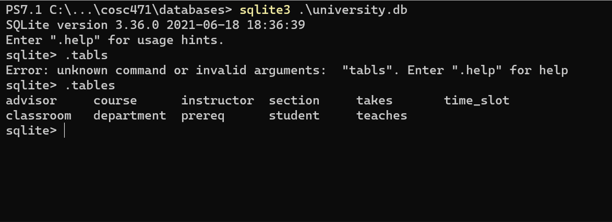
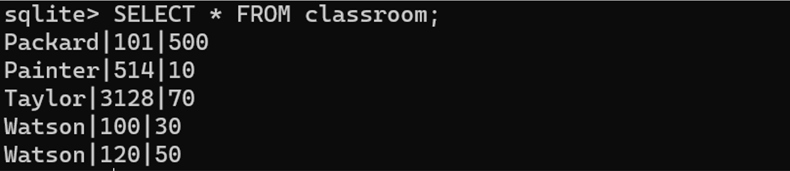
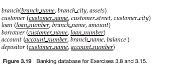
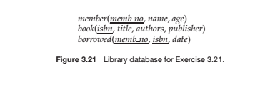
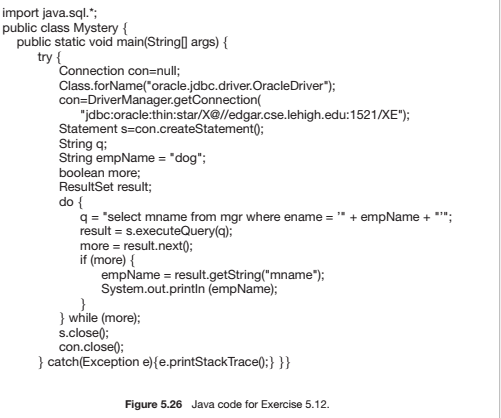

# Homework 2

ahmed muhammad

cosc471

2021-10-05

## 1). Database creation





## 2). Run the queries...

* List all students

```sql
SELECT "name" FROM student;
```

|name|
|----|
|Zhang|
|Shankar|
|Brandt|
|Chavez|
|Peltier|
|Levy|
|Williams|
|Sanchez|
|Snow|
|Brown|
|Aoi|
|Bourikas|
|Tanaka|

* List only course_ids of courses that are offered in Spring 2009.

```sql
SELECT course_id
FROM section
WHERE "year" = 2009 AND semester = "Spring";
```

|course_id|
|---------|
|CS-190|
|CS-190|
|EE-181|

* List only student names and how many more credits they have to take to complete their degree. Assume that the degree completion requirement is 124 credits for all students.

```sql
SELECT "name", 124 - tot_cred AS remaining_credits_to_grad
FROM student;

```

|name|remaining_credits_to_grad|
|----|-------------------------|
|Zhang|22|
|Shankar|92|
|Brandt|44|
|Chavez|14|
|Peltier|68|
|Levy|78|
|Williams|70|
|Sanchez|86|
|Snow|124|
|Brown|66|
|Aoi|64|
|Bourikas|26|
|Tanaka|4|

* Find the total number of instructors and their average salary.

```sql
SELECT
  COUNT(*) AS num_instructors,
  AVG(salary) AS avg_salary
FROM instructor;
```

|num_instructors|avg_instrutor_salary|
|-|-|
|12|74833.3333333333|

* List only course_ids of all courses that are either offered in Spring or Summer.

```sql
SELECT DISTINCT(course_id) AS spring_or_summer_course_id
FROM section
WHERE semester IN ('Spring', 'Summer');
```

|spring_or_summer_course_id|
|--------------------------|
|BIO-101|
|BIO-301|
|CS-101|
|CS-190|
|CS-315|
|CS-319|
|EE-181|
|FIN-201|
|HIS-351|
|MU-199|

* List all rooms that have a capacity of at least 50 and utmost 100.

```sql
SELECT room_number AS medium_size_room
FROM classroom
WHERE capacity BETWEEN 50 AND 100;
```

|medium_sized_room|
|-----------------|
|3128|
|120|

* List all instructors who have a name that begins with K.

```sql
SELECT "name" AS k_name
FROM instructor
WHERE "name" LIKE 'K%';
```

|k_name|
|------|
|Katz|
|Kim|

* List only student_ids of students who have received a grade of A, A-, or B+ in any course.

```sql
SELECT DISTINCT("ID")
FROM takes
WHERE grade IN ('A', 'A-', 'B+');
```

|ID|
|--|
|00128|
|12345|
|45678|
|54321|
|55739|
|76543|
|98988|

## 3). Exercise 3.11

you may want to ignore ‘Spring’ in part b. Run these queries on the university database you have created. Submit actual queries and their results (copy and paste text would be best)

1. Find the names of all students who have taken at least one Comp. Sci. course; make sure there are no duplicate names in the result.

```sql
SELECT DISTINCT("name")
FROM takes, student, course
WHERE

  -- join conditions
  takes.ID = student.ID
  AND takes.course_id = course.course_id

  -- filter for comp. sci.
  AND title = 'Intro. to Computer Science';
```

|name|
|----|
|Zhang|
|Shankar|
|Levy|
|Williams|
|Brown|
|Bourikas|

2. Find the IDs and names of all students who have not taken any course offering before Spring 2009.

```sql
SELECT ID, "name"
FROM takes NATURAL JOIN student
WHERE "year" < 2009;
```

|ID|name|
|--|----|
|00128|Zhang|
|00128|Zhang|
|12345|Shankar|
|12345|Shankar|
|12345|Shankar|
|44553|Peltier|
|45678|Levy|
|54321|Williams|
|54321|Williams|
|76543|Brown|
|76653|Aoi|
|98765|Bourikas|
|98988|Tanaka|

3. For each department, find the maximum salary of instructors in that  department. You may assume that every department has at least one  instructor.

```sql
SELECT dept_name, MAX(salary)
FROM instructor NATURAL JOIN department
GROUP BY dept_name;
```

|dept_name|MAX(salary)|
|---------|-----------|
|Biology|72000|
|Comp. Sci.|92000|
|Elec. Eng.|80000|
|Finance|90000|
|History|62000|
|Music|40000|
|Physics|95000|

4. Find the lowest, across all departments, of the per-department maximum salary computed by the preceding query. 

```sql
SELECT MIN("MAX(Salary)") AS min_salary
FROM (
  SELECT dept_name, MAX(salary)
  FROM instructor NATURAL JOIN department
  GROUP BY dept_name
);

```

|min_salary|
|-|
|40000|

## 4). Exercise 3.15 – parts b and c only.



Consider the bank database of Figure 3.19, where the primary keys are underlined. Construct the following SQL queries for this relational database.

1. ~~Find all customers who have an account at all the branches located in  “Brooklyn”.~~

2. Find out the total sum of all loan amounts in the bank.

<span style="color: orange;">I'm a little confused by the question, are they asking to find the total sum of all loans? Or are they asking for loan amount by each bank?</span>

```sql
-- total sum of all loans
SELECT SUM(amount) FROM loan;
```

```sql
-- loan amount by each bank
SELECT branch_name, SUM(amount)
FROM loan
GROUP BY branch_name;
```

3. Find the names of all branches that have assets greater than those of at least one branch located in “Brooklyn”.

```sql
SELECT branch_name
FROM branch
WHERE assets > (SELECT MIN(assets) FROM branch WHERE branch_city = 'Brooklyn');
```

## 5). Exercise 3.21 – parts a and c only.



Consider the library database of Figure 3.21. Write the following queries in  SQL.

1. Print the names of members who have borrowed any book published by “McGraw-Hill”.

```sql
SELECT "name"
FROM borrowed, book, member
WHERE
  -- join conditions
  borrowed.memb_no = member.memb_no AND borrowed.isbn = book.isbn
  -- filter
  AND book.publisher = 'McGraw-Hill';

```

2. ~~Print the names of members who have borrowed all books published  by “McGraw-Hill”.~~

3. For each publisher, print the names of members who have borrowed more than five books of that publisher.

```sql
SELECT "name"
FROM borrowed, book, member
WHERE
  -- join conditions
  borrowed.memb_no = member.memb_no AND borrowed.isbn = book.isbn
  -- filter condition
GROUP BY publisher
HAVING COUNT(borrowed.isbn) > 5;
```

4. ~~Print the average number of books borrowed per member. Take into account that if an member does not borrow any books, then that member does not appear in the borrowed relation at all~~


## 6). Exercise 4.14

Show how to define a view tot_credits (year, num_credits), giving the total number of credits taken by students in each year.

```sql
CREATE VIEW tot_credits AS (
  SELECT "year", SUM(tot_cred)
  FROM takes NATURAL JOIN student
  GROUP BY "year"
);
```

|year|SUM(tot_cred)|
|-|-|
|2009|846|
|2010|628|

## 7). Exercise 5.12



5.12 Consider the following relations for a company database:

* emp (ename, dname, salary)
* mgr (ename, mname)

and the Java code in Figure 5.26, which uses the JDBC API. Assume that  the userid, password, machine name, etc. are all okay. Describe in concise  English what the Java program does. (That is, produce an English sentence like “It finds the manager of the toy department,” not a line-by-line  description of what each Java statement does.)

This code is continuously querying the "mgr" (manager) relation by employee name (ename) starting with the ename "dog"; if dog has a manager then it will find that manager's name and print it and query the "mgr" relation again. It'll keep looking for each manager's manager and printing them out until it finds the managerless manager.