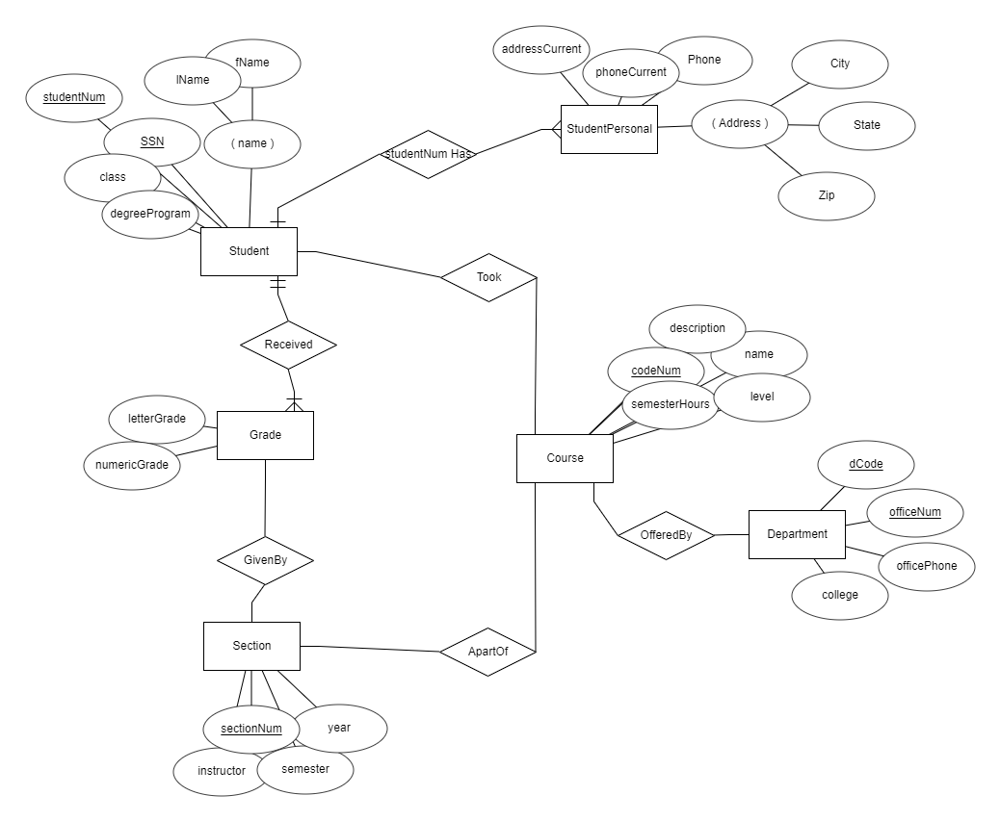
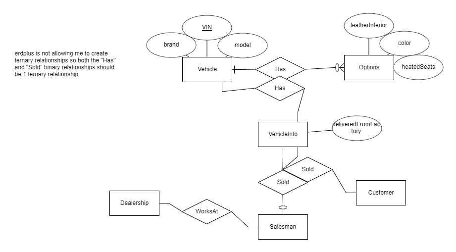
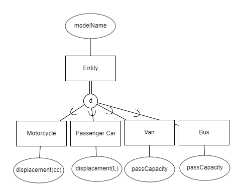
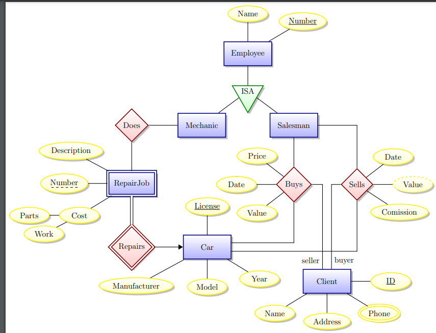
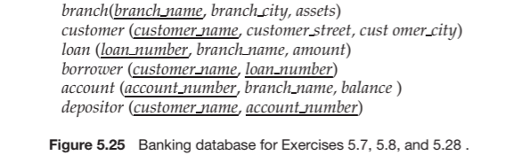
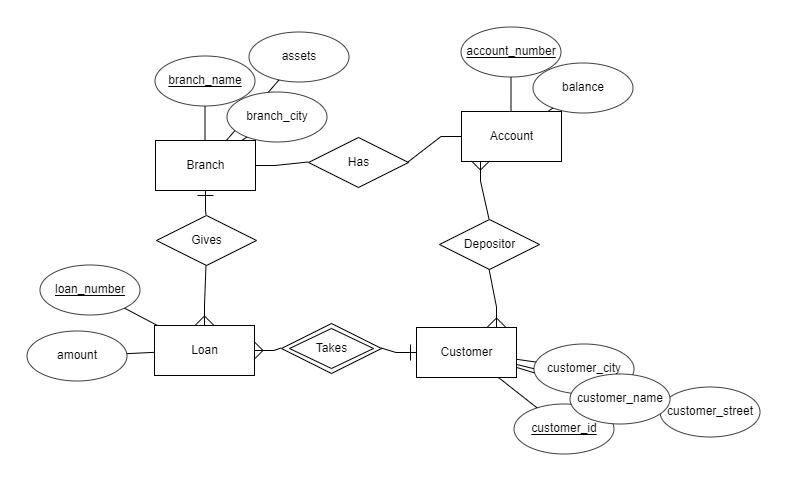

# Homework 3

ahmed muhammad - cosc471 - 2021/08/26

### 7.0

7.0 (10 pts.) – This question is not included in the textbook.

* Consider the following set of requirements for a university database that is used to keep track of student’s transcripts. This is not the same as the university database from the textbook.
* The university keeps track of each student's name, student number, social security number, current address and phone, permanent address and phone, birth date, sex, class (freshman, sophomore, ..., graduate), major department, minor department (if any), and degree program (B.A., B.S., ..., Ph.D.). Some user applications need to refer to the city, state, and zip of the student's permanent address, and to the students' last name. Both social security number and student number have unique values for each student.
* Each department is described by a name, department code, office number, office phone and college. Both name and code have unique values for each department.
* Each course has a course name, description, code number, number of semester hours, level, and offering department. The value of code number is unique for each course.
* Each section has an instructor, semester, year, course, and section number. The section number distinguishes different sections of the same course that are taught during the same semester/year; its values are 1, 2, 3, ...; up to the number of sections taught during each semester.
* A grade report has a student, section, letter grade and numeric grade.

Draw an ER diagram for this database. Specify key attributes of each entity type and structural constraints on each relationship type. Note any unspecified requirements, and make appropriate assumptions to make the specification complete.

Design a database for an automobile company to provide to its dealers to  assist them in maintaining customer records and dealer inventory and to  assist sales staff in ordering cars.  Each vehicle is identified by a vehicle identification number (VIN). Each  individual vehicle is a particular model of a particular brand offered by the  company (e.g., the XF is a model of the car brand Jaguar of Tata Motors).  Each model can be offered with a variety of options, but an individual  car may have only some (or none) of the available options. The database  needs to store information about models, brands, and options, as well as  information about individual dealers, customers, and cars.

Design a generalization-specialization hierarchy for a motor vehicle sales company. The company sells motorcycles, passenger cars, vans, and busses.
Justify your placement of attributes at each level of the hierarchy. Explain why they should not be placed at a higher or lower level. Draw EER.

forward engineer this ER diagram

* Employee(<u>ENumber</u>, Name, Type)
* RepairJob(Description, <u>Number</u>, Parts, Work, _License_)
* Car(Model, Manufacturer, Year, <u>License</u>)
* Client(<u>ClientID</u>, Name, Phone, Address, _ENumber_)
* Buys(Value, Date, Price, _ClientID_, _License_)
* Sells(Value, Date, Commission, _ClientID_, _License_)

