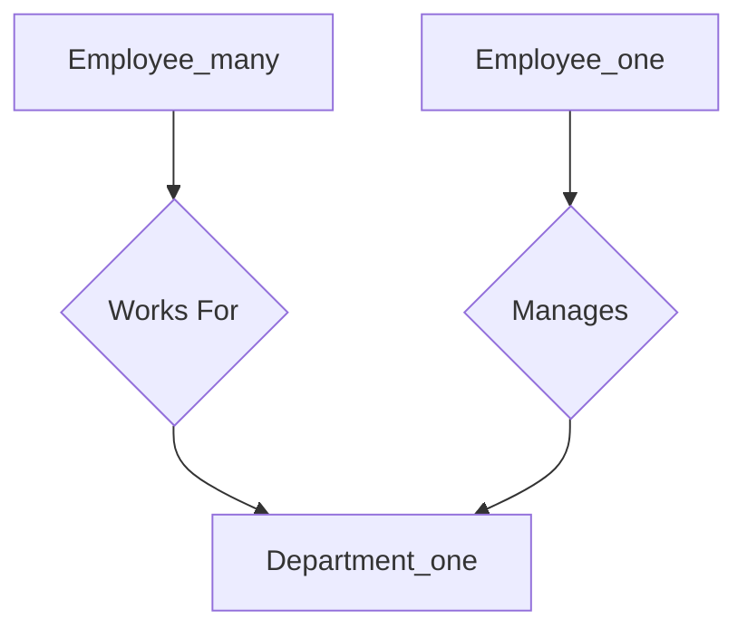

# Week 6

## Entity-Relationship Model

### Conceptual Design

Conceptual design -> Logical design -> Physical design

* Reduce redundancy
* Complete requirements
* Simplicity

### Set Theory Refresher

* sets must be of the same data type

x = { 8, 3, 7, 5, 6, 1 }

y = { 'Sam', 'Mary', 'Peter' }

* this is a set description (all items in set are integers)

z = { z| z is an integer }

* relationships

R(y, x) = ages = { ('Sam', 8), ('Mary', 5), ('Peter', 1) }
= { (y, x) | x ex ^ yey ^ x is y's age }

* These are entity sets (tables) and each item is an entity (cell, cell's value)
* An entity is an object that exists and is distinguishable from other objects
* Attributes = Columns, used to describe entity

Adult( Name, Age, Address )

Child ( Name, Age, )

* Relating two entities together creates relationships

Parent-of: Adult -> Child

Married-to: Adult <-> Adult

Siblings: Child <-> Child

* Entity relationship model
* a database can be modeled as:
  * a collection of entities
  * relationship among entities
* Entity set is a collection of entities of the same type that share the same attributes
* The schema is the entity type, and a description of the entity set

### Entities

* represented as a rectangle
* name of entity at top
* attributes are listed

### Attributes

* single-valued
* multi-valued
  * e.g. phone for an employee
  * an employee can have multiple phones
  * in the ER diagram these attributes are surrounded by curly braces
* composite attribute
  * e.g. address
  * can be stored as three attributes like street, city, and zip
* derived attribute
  * not stored but can be computed later
  * e.g. age can be derived from date-of-birth

### Relationships

* denoted as a diamond
* given a name
* binary relationships -- between two entities
* ternary relationship -- between three entities
  * shouldn't write relationships greater than this

### Keys

### Constraints

* Structural Constraints
  * Cardinality
    * denoted by n or 1 above the entity box
    * recursive relationships (entity to itself) cannot be donated
      * the lines must be labeled
  * Participation constraint
    * denoted by double lines
    * one line means partial participation
      * department can have no employees, one line
  * Weak entity
    * a table that doesn't exist by itself
    * keys are written with a 
    * double lined diamond

### Roles

### Naming Conventions

* goes either top to bottom or left to right

## Extended ER Model

* Why EER?
  * more semantically rich
  * better for complex relationships

* page 305 in textbook
* C = subset
* B C A, C C A
* e.g. Student -> UG * G students
* Classes, subclass...
  * subclasses inherit all properties (attributes) of their superclass and then define their own attributes
  * specializing/top-down process refers to representing a general concept and then subclassing it later
  * generalizing/bottom-up process refers to representing more specialized entities (like car, truck) and later defining a parent entity (vehicle) for the specialized entities
  * super classes don't inherit relationships particular to their subclasses
  * subclasses have what's called an "is-a" relationship
* Constraints:
  * Disjoint
    * e.g. employee is subclasses by salaried and hourly employees; only one of these subclasses can apply (i.e. if you're a salaried employee you can't be an hourly employee)
  * Overlap
    * e.g. a University employee is subclasses by Staff and Instructor; but department heads are both members of Staff and they teach as well
  * Attribute or Condition Defined
    *
  * User-defined
  * Total or Partial

### UML
