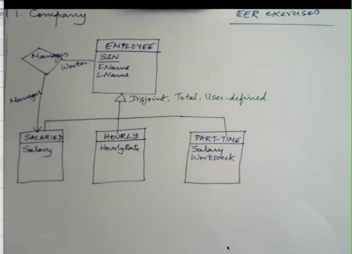
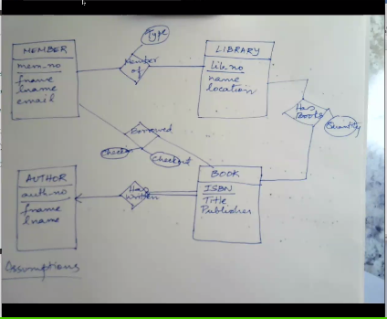

# Week 7

## Reduction to Relational Schemas

* Forward engineering: going from conceptual model (ER) to logical model (relational schema)
* Reverse engineering: going back from relation schema to an ER diagram

### Process

* Entity type E (not weak) -> new relation T
* Relation T
  * includes all simple attributes (non composite, single valued) from E
  * includes only simple component attributes of a composite attribute from E
  * we choose a primary key for T
* E(A1, A2, A3, A4, A5) -> T(__A1__, A2, A3, A4.1, A4.2, A4.3) S(A1, A5)
  * A4 is a composite attribute that looks like A4.1, A4.2, A4.3 (like address being split up into street, city, zip)
  * The name A4 is lost in translation
  * A5 is a multi-valued attribute
    * A multi-valued attribute A maps to a new relation X from the entity set E
    * Relation S:
      * Included attribute A
      * includes primary key of E as a foreign key of S
      * attribute A and primary key of E form the primary key of S
* Weak entity type W maps to new relation T (with owner entity set E)
  * relation T
    * includes all simple attributes (non composite, single-valued) from W
    * includes primary key attributes of the owners entity set E as foreign key attributes
    * primary key of T is a combination of the partial key of W and primary key of E
23 minutes

### Class

this diagram shows a disjointed relationship

* FAT relation (disliked)
  * employee(SSN, FN, LN, Salary, HourlyRate, WorkWeek, Flag)
  * Flag = Salaried|Hourly|Part-time

* alternative
  * employee(SSN, FN, LN)
  * Salaried(SSN, Salary)
  * Hourly(SSN, HourlyRate)
  * PartTime(SSN, Salary, WorkWeek)

* Patient(<u>PID</u>, Name)
* Doctor(<u>DID</u>, Name)
* Assistant(<u>AID</u>, Name)
* Ward(<u>Name</u>, location)
* HelpedBy(<u>PID</u>, <u>AID</u>, Date)
  * m:m becomes own table
* HasPrimary(<u>PID</u>, <u>DID</u>)
  * m:m becomes own table
* TreatedIn(_PID_, _Name_, Purpose, Date)
  * m:1 doesn't have to be a separate table (would be in Patient table then)
  * otherwise primary keys would actually be foreign keys
  * being a m:1 relationship limits this entire diagram b/c a patient could be treated in many wards
    * to fix this, document this relationship as a m:m relationship
* WorksIn()
  * m:1 just include in Assistant table, no attributes to worry about

Club Database

* Member(<u>MID</u>, Type1, Type2, Board, Year)
  * Type is flag can be just one attribute
    * keeping it as one attribute means that people can only be one kind of member
    * separating it allows for more flexibility
  * Year is multi-valued so must be its own table
* Year(<u>MID</u>, <u>Annual Year</u>)
* Event(<u>EID</u>)
* Organize(<u>MID</u>, <u>EID</u>)
  * m:m relationship must become its own table

#### Exercises

* could also be a multi values attribute

